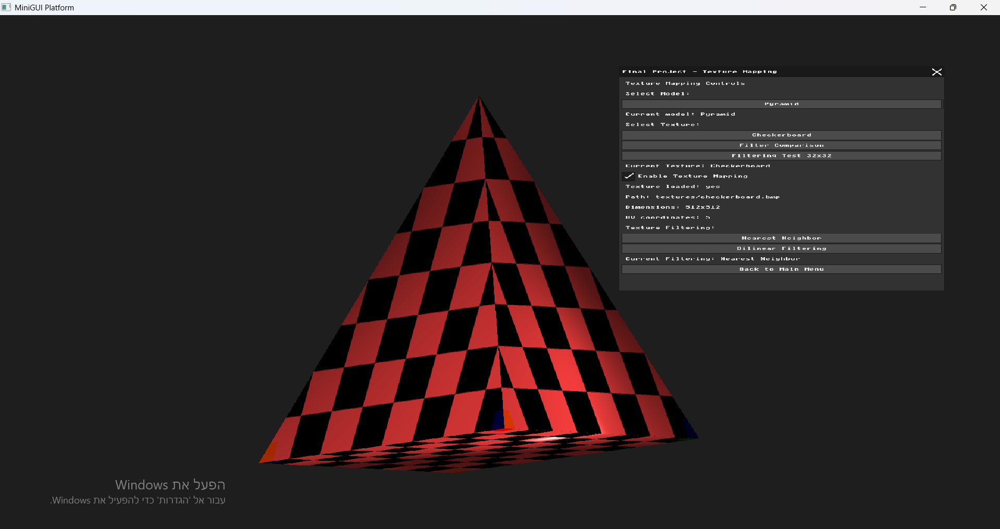
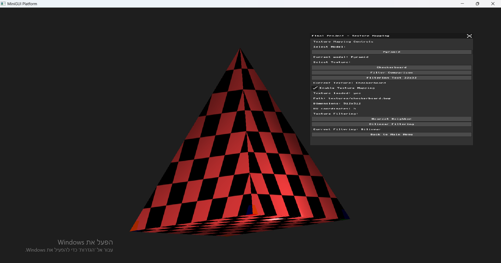
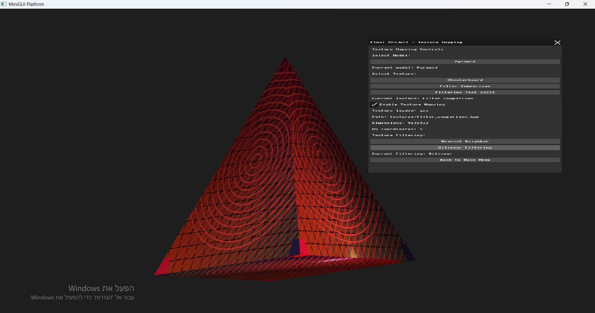
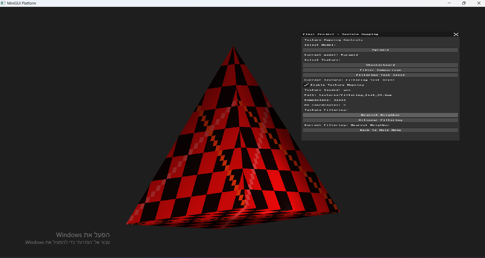

# Final Project – Texture Mapping

## 1. Introduction

In this final project, I extended the software renderer developed during the course by adding support for Texture Mapping.
The goal was to allow 2D images (textures) to be mapped onto the surfaces of 3D models instead of rendering the models using only a uniform surface color.
The implementation was integrated into the existing rendering pipeline, including the Phong lighting model developed in the previous assignments.
In addition, two texture filtering methods were implemented and compared:

- Nearest Neighbor Filtering
- Bilinear Filtering

The comparison demonstrates how the filtering method affects the visual quality of a texture when it is sampled and mapped onto a 3D model.

## 2. Project Goals

The main goals of the project were:
- Load texture coordinates (UV coordinates) from OBJ models.
- Load BMP texture images.
- Map texture coordinates to the triangles of a 3D model.
- Sample the texture during triangle rasterization.
- Combine the sampled texture color with the existing Phong shading.
- Implement Nearest Neighbor texture filtering.
- Implement Bilinear texture filtering.
- Compare the visual results of the two filtering methods.
- Test the implementation using textures with different resolutions.

## 3. Implementation

### 3.1 Loading UV Coordinates from OBJ Models

To apply a 2D texture to a 3D model, the renderer needs texture coordinates that define which point of the texture corresponds to each vertex of the model.
The OBJ loader was extended to read UV coordinates (`vt`) from OBJ files and store them as part of the mesh data.
During rendering, the UV coordinates associated with each triangle are passed to the rasterization stage, where they are interpolated across the triangle.
This allows every pixel inside the triangle to obtain a corresponding position in the texture image.

### 3.2 Loading BMP Textures

Support for loading BMP texture images was added to the renderer.
The texture loader reads the image dimensions and pixel data and stores them in a texture structure that can be accessed during rasterization.
Several BMP textures were used in the project, including a checkerboard texture and additional test textures designed to demonstrate the differences between texture filtering methods.

### 3.3 Texture Mapping During Rasterization

During triangle rasterization, the UV coordinates are interpolated for every pixel inside the triangle.
The interpolated UV coordinates are then used to determine the corresponding position in the loaded texture.
The color sampled from the texture is used as the surface color of the pixel instead of using only a constant material color.
This process maps the 2D texture image onto the surface of the 3D model.

### 3.4 Integration with Phong Shading

Texture mapping was integrated with the existing Phong lighting implementation.
Instead of replacing the lighting calculation, the sampled texture color is combined with the Phong shading result.
As a result, the texture remains visible on the model while the effects of the lighting, such as diffuse illumination and specular highlights, are still preserved.

**Figure 1: Checkerboard texture mapped onto the pyramid model with Phong shading.**

## 4. Texture Filtering

Texture filtering determines how the renderer samples a color from the texture when the UV coordinates do not correspond exactly to the center of a texture pixel (texel).
Two filtering methods were implemented in the project:
- Nearest Neighbor Filtering
- Bilinear Filtering
Both methods use the same interpolated UV coordinates, but they differ in the way the final texture color is calculated.

### 4.1 Nearest Neighbor Filtering

Nearest Neighbor is the simpler texture sampling method.
For each interpolated UV coordinate, the renderer selects the nearest texel in the texture and directly uses its color.
This method is computationally simple and preserves sharp texel boundaries. However, when a low-resolution texture is enlarged on the surface of a model, individual texels become visible and the result can appear pixelated or contain noticeable step-like edges.

### 4.2 Bilinear Filtering

Bilinear Filtering produces a smoother texture by considering the four texels surrounding the sampled texture position.
Instead of selecting only one texel, the renderer interpolates between the colors of these four neighboring texels according to the position of the UV coordinate between them.
This reduces abrupt transitions between texels and produces smoother edges and color transitions, especially when a low-resolution texture is enlarged.

### 4.3 Filtering Selection

A filtering selection was added to the Final Project user interface.
The user can switch between Nearest Neighbor and Bilinear Filtering while rendering the same model and texture. This makes it possible to directly observe the visual effect of changing only the texture sampling method.
The interface also displays the currently selected filtering method.

## 5. Comparison of Nearest Neighbor and Bilinear Filtering

To evaluate the effect of texture filtering, both Nearest Neighbor and Bilinear Filtering were tested using three different textures.
For each test, the same 3D model, UV coordinates, texture, and rendering configuration were used. Only the texture filtering method was changed.
This allows a direct comparison between the two filtering methods.

### 5.1 Checkerboard Texture – 512×512

The first comparison was performed using the 512×512 checkerboard texture.
With Nearest Neighbor Filtering, the checkerboard boundaries remain sharp because each texture sample uses the color of a single nearest texel.
With Bilinear Filtering, neighboring texels are interpolated, producing slightly smoother transitions along the checkerboard boundaries.
Because this texture has a relatively high resolution, the visual difference between the two methods is noticeable but not very large.

**Figure 5: Checkerboard texture rendered using Nearest Neighbor Filtering.**

**Figure 6: Checkerboard texture rendered using Bilinear Filtering.**

### 5.2 Filter Comparison Texture – 512×512

The second comparison used the 512×512 Filter Comparison texture.
This texture contains more detailed patterns, including thin lines, circles, gradients, and high-contrast regions.
Nearest Neighbor preserves sharper transitions between texels, while Bilinear Filtering smooths the transitions by interpolating between neighboring texel colors.
The difference is more noticeable around thin lines and detailed regions, although both methods still produce relatively similar results because of the high texture resolution.

**Figure 7: Filter Comparison texture rendered using Nearest Neighbor Filtering.**

**Figure 8: Filter Comparison texture rendered using Bilinear Filtering.**

### 5.3 Low-Resolution Filtering Test – 32×32

The third comparison used a low-resolution 32×32 texture.
This test produces the clearest difference between the two filtering methods because a small number of texels are stretched over a much larger area of the 3D model.
With Nearest Neighbor Filtering, individual texels become clearly visible. The result contains sharp, pixelated boundaries and noticeable stair-step patterns.
With Bilinear Filtering, the renderer interpolates between neighboring texels. This creates smoother transitions and significantly reduces the pixelated appearance.
Therefore, the 32×32 texture provides the clearest demonstration of the visual advantage of Bilinear Filtering when a low-resolution texture is enlarged.

**Figure 9: 32×32 test texture rendered using Nearest Neighbor Filtering.**

**Figure 10: 32×32 test texture rendered using Bilinear Filtering.**

### 5.4 Comparison Summary

The experiments show that the visual difference between Nearest Neighbor and Bilinear Filtering depends strongly on the texture resolution.
With the 512×512 textures, both methods produce relatively similar results because the texture contains enough texels to represent the details at the tested viewing scale. However, Bilinear Filtering still produces slightly smoother transitions around edges and detailed regions.
The difference becomes much clearer with the 32×32 texture. Nearest Neighbor produces visible texels, sharp transitions, and a more pixelated appearance, while Bilinear Filtering smooths these transitions by interpolating between neighboring texels.
This experiment demonstrates why texture resolution and filtering method both have an important effect on the final rendered image.

## 6. Conclusion

In this project, the software renderer was extended with a complete texture mapping pipeline.
The implementation included loading UV coordinates from OBJ models, loading BMP texture images, interpolating UV coordinates during rasterization, sampling texture colors, and combining the resulting texture with the existing Phong shading implementation.
Two texture filtering methods, Nearest Neighbor and Bilinear Filtering, were implemented and compared using three different textures.
The experiments showed that Bilinear Filtering provides smoother results, especially when low-resolution textures are enlarged, while Nearest Neighbor preserves sharper texel boundaries and can produce a more pixelated appearance.
Overall, the project demonstrates how texture mapping and texture filtering can significantly improve the visual appearance of rendered 3D models and how different sampling methods affect the final rendering result.